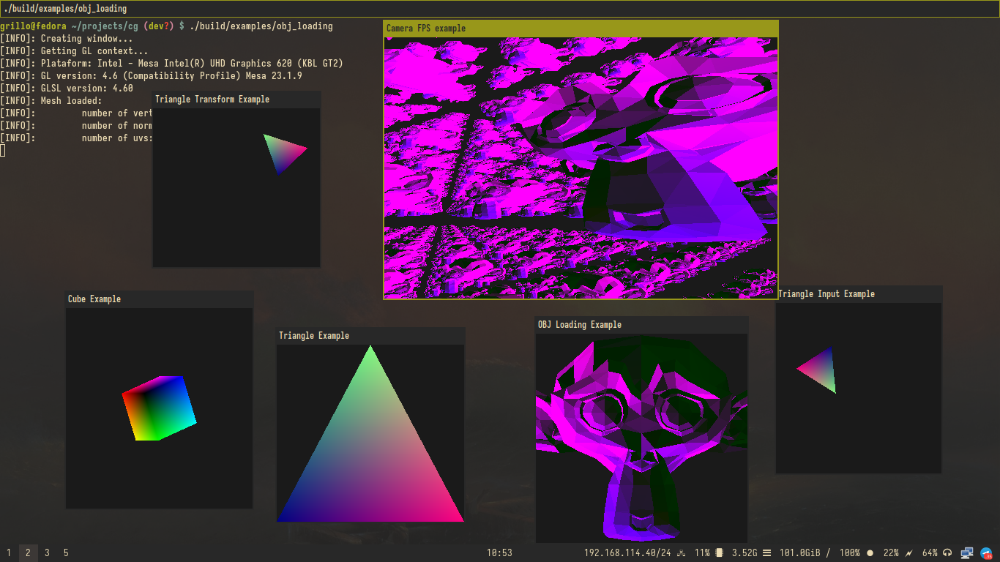

# cg

A library for doing my computer graphics class work.

## How to build it

```console
$ meson build
$ meson compile -C build
```
## examples



cg has some examples showing how to use the library.

To run them:

```console
$ ./build/examples/<any-example>
```
